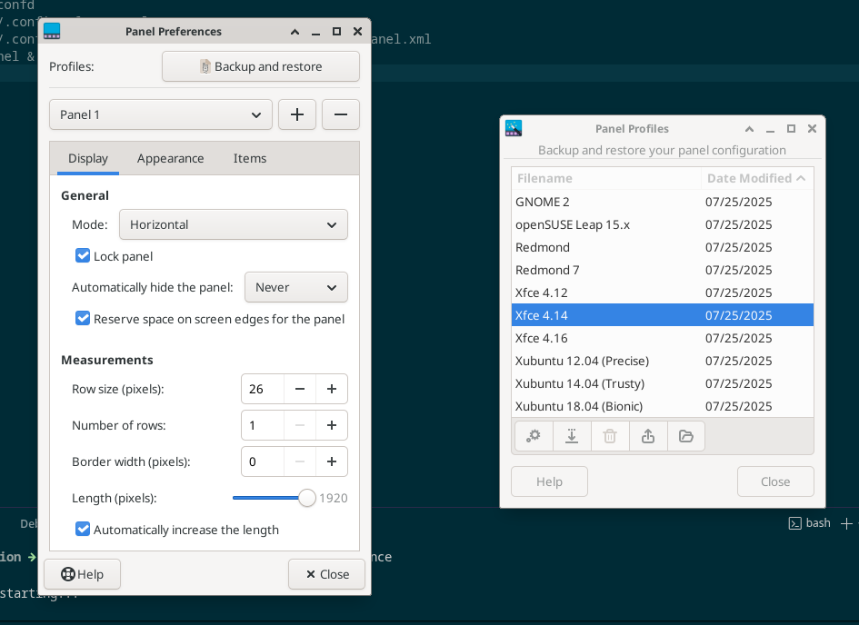

# xfce configuration steps
## remove old configuration
mv ~/.config/xfce4 ~/.config/xfce4.bak
mv ~/.cache/xfce4 ~/.cache/xfce4.bak
## reseting panels 
xfce4-panel --quit
pkill xfconfd
rm -rf ~/.config/xfce4/panel
rm -rf ~/.config/xfce4/xfconf/xfce-perchannel-xml/xfce4-panel.xml
xfce4-panel &

or Setting > Panel 

## Downloading themes and icons 
## installing murring engine
sudo dnf install gtk-murrine-engine
## installing plnak
## installing conky
## install conky manager 
sudo dnf copr enable geraldosimiao/conky-manager2
sudo dnf install conky-manager2
## installing other packages to avoid warning 
sudo dnf install gtk3-devel pkgconf-pkg-config
## install package to run conky Mono Player
sudo dnf install https://mirrors.rpmfusion.org/free/fedora/rpmfusion-free-release-$(rpm -E %fedora).noarch.rpm
sudo dnf install -y vnstat moc
sudo systemctl enable --now vnstat

What if you don't want to add extra repositories?
If you prefer to keep your system minimal and only want the network stats for Conky, you can just install vnstat alone (which is in the standard Fedora repo):
bash
sudo dnf install -y vnstat
sudo systemctl enable --now vnstat

## install Polybar 
sudo dnf install polybar

## using polybar themes 

## install picmon to effect glass effect blur
sudo dnf install picom
## Downloading Wallpaper

## install nerd font 
curl -OL https://github.com/ryanoasis/nerd-fonts/releases/latest/download/JetBrainsMono.tar.xz 
sudo mkdir -p /usr/local/share/fonts/nerd-fonts
sudo mv * /usr/local/share/fonts/nerd-fonts
sudo chmod -R 644 /usr/local/share/fonts/nerd-fonts
sudo chmod 755 /usr/local/share/fonts/nerd-fonts
sudo fc-cache -fv
for only user : ~/.local/share/fonts/

## install yad for notifications
sudo dnf install yad 

## install image editor 
sudo dnf install kolourpaint mtpaint pinta
---
## Setting initial stow

